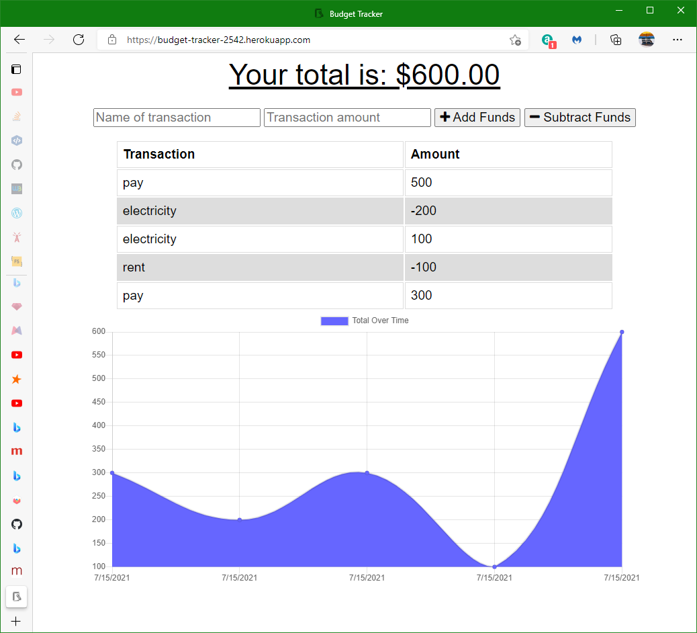

# Budget-Tracker
## Description
Simple web app for recording credits and debits to an account. The total of all of these transactions is shown in a chart. Transactions are kept in a MongoDB Atlas database. If this app is offline then transactions are stored in an IndexedDB until the next tranctions is made when this app is online.  

This app is deployed on Heroku at  

[https://budget-tracker-2542.herokuapp.com/](https://budget-tracker-2542.herokuapp.com/)

## Installation
The GitHub repository for this app is  

[https://github.com/minprocess/19-Budget-Tracker](https://github.com/minprocess/19-Budget-Tracker)

### Tech used
Mongoose for MongoDB Atlas is used for transactions. IndexedDB used for storing transaction when the app is offline. Other tech used are Node, Cxpress, HTML, CSS, JavaScript, IndexedDB and Chart.js

## Usage

  

