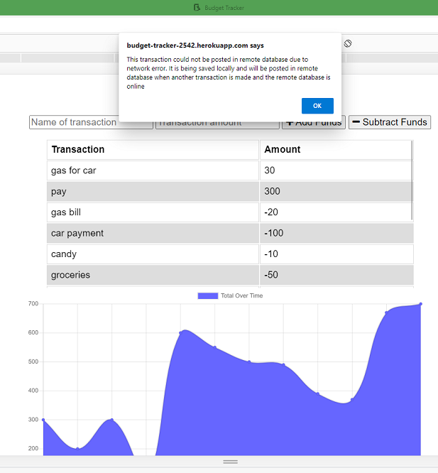

# Budget-Tracker
## Description
Simple web app for recording credits and debits to an account. The total of all of these transactions is shown in a chart. Transactions are kept in a MongoDB Atlas database. If this app is offline then transactions are stored in an IndexedDB until the next tranctions is made when this app is online.  

This app is deployed on Heroku at  

[https://budget-tracker-2542.herokuapp.com/](https://budget-tracker-2542.herokuapp.com/)

## Installation
The GitHub repository for this app is  

[https://github.com/minprocess/19-Budget-Tracker](https://github.com/minprocess/19-Budget-Tracker)

### Tech used
When this app is online, Mongoose for MongoDB Atlas is used for transactions. When this app is offline, IndexedDB used for storing transaction. When the app has been offline and a transaction is made after return to online, the transactions stored in indexed DB are posted to the MongoDB Atlas. See db.js for the code responsible for transactions made when this app is offline. Other tech used are Node, Cxpress, HTML, CSS, JavaScript, IndexedDB and Chart.js

## Usage
The snapshot below shows the homepage of the Budget Tracker.  

  

The snapshot below shows the alert that appears when a transaction is made offline. The offline condition was simulated using the DevTools in Edge.

  

## Credits

Trilogy Education Services provided the starter code. 

## License

Copyright (c) [2021] [William T Pate]

Permission is hereby granted, free of charge, to any person obtaining a copy
of this software and associated documentation files (the "Software"), to deal
in the Software without restriction, including without limitation the rights
to use, copy, modify, merge, publish, distribute, sublicense, and/or sell
copies of the Software, and to permit persons to whom the Software is
furnished to do so, subject to the following conditions:

The above copyright notice and this permission notice shall be included in all
copies or substantial portions of the Software.

THE SOFTWARE IS PROVIDED "AS IS", WITHOUT WARRANTY OF ANY KIND, EXPRESS OR
IMPLIED, INCLUDING BUT NOT LIMITED TO THE WARRANTIES OF MERCHANTABILITY,
FITNESS FOR A PARTICULAR PURPOSE AND NONINFRINGEMENT. IN NO EVENT SHALL THE
AUTHORS OR COPYRIGHT HOLDERS BE LIABLE FOR ANY CLAIM, DAMAGES OR OTHER
LIABILITY, WHETHER IN AN ACTION OF CONTRACT, TORT OR OTHERWISE, ARISING FROM,
OUT OF OR IN CONNECTION WITH THE SOFTWARE OR THE USE OR OTHER DEALINGS IN THE
SOFTWARE.